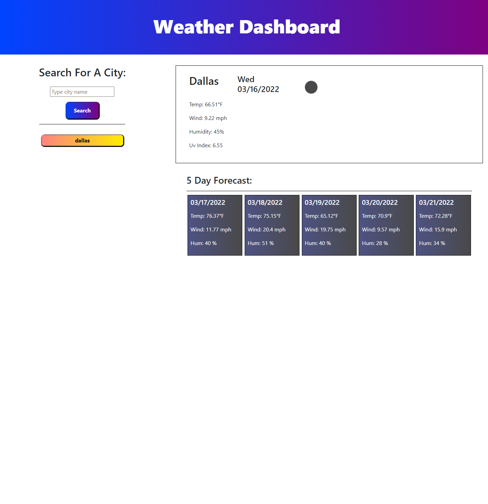

# server-side-apis-weather-dashboard

## Objectives

The purpose of this assignment was to create a program in javascript that will act as a weather dashboard. There is a search button allowing the user to search any city in the world. When searched the user will be provided with current weather infomation for the day as well as for the 5 days to come. Every time a city is searched a new button will be created below that will allow the user to search those cities once again. They are being saved into local storage.

## Screenshot of Final Page

## Link to the Final Page and GitHub

[Here is a link to my final page](https://jandrewanderson.github.io/server-side-apis-weather-dashboard/)

[Here is the link to my Github Repository](https://github.com/jandrewanderson/server-side-apis-weather-dashboard)

### Contributions

Joseph Andrew Anderson

### Resources

https://www.w3schools.com/html/html5_semantic_elements.asp
https://www.pluralsight.com/guides/semantic-html
https://stackoverflow.com

My tutor: Abdullah Al Hilfi

### License

This code is licensed under the MIT License.